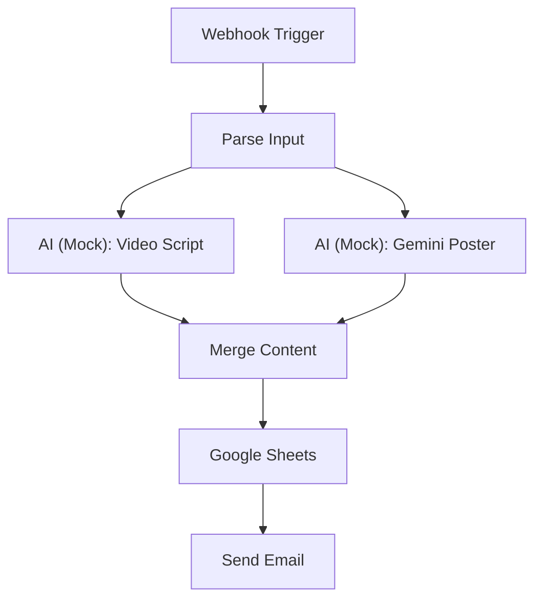

# AI Content Factory - Architecture & Logic

## 1. Overview
This n8n workflow simulates an automated "Content Factory" pipeline. It accepts product details via a webhook, generates marketing assets using simulated AI nodes, and delivers the results via Google Sheets and Email.

**Key Features:**
*   **Trigger**: Webhook-based entry point.
*   **AI Simulation**: Mocks GPT-4 (Script) and Gemini/Imagen (Poster) generation.
*   **Integration**: Connects to real Google Sheets and Email services.
*   **Parallel Execution**: Generates assets simultaneously for efficiency.

---

## 2. Visual Workflow



---

## 3. Workflow Logic (Step-by-Step)

1.  **Trigger**: The workflow receives a POST request with `product_name` and `platform`.
2.  **Parsing**: It extracts these values, applying defaults if missing.
3.  **Parallel Generation**:
    *   **Path A**: Generates a 15-second video script (Simulating GPT-4).
    *   **Path B**: Generates a promotional poster URL (Simulating Gemini/Imagen).
4.  **Merge**: The parallel branches wait for each other and combine their outputs.
5.  **Storage**: The combined data is appended to a Google Sheet.
6.  **Notification**: An email is sent containing the script and poster link.

---

## 4. Component Details

###  Input & Trigger
*   **Webhook Trigger**: Listens on `/webhook/ai-content-factory` (POST).
*   **Parse Input**: Standardizes input data structure.

### AI Simulation (Mock Nodes)
*   **Video Script**: Uses a `Set` node to create a template-based script.
*   **Gemini Poster**: Uses a `Set` node to generate a placeholder image URL (`picsum.photos`).

### Real Integrations
*   **Google Sheets**: Appends a new row with Timestamp, Product, Platform, Script, and Poster URL.
*   **Send Email**: Uses SMTP to send the final marketing package to the user.

---

## 5. Configuration Requirements

To run this workflow successfully, you must configure the following in n8n:

1.  **Google Sheets Credentials**:
    *   Create OAuth2 credentials in Google Cloud Console.
    *   Connect them in the "Google Sheets" node.
2.  **SMTP Credentials**:
    *   Use Gmail App Password or other SMTP provider.
    *   Connect them in the "Send Email" node.

---

## 6. Sample Output

**Input Payload:**
```json
{
  "product_name": "EcoBottle",
  "platform": "Instagram"
}
```

**Generated Result:**
> **Video Script:**
> "[SCENE 1] Close-up of crystal-clear water flowing into EcoBottle..."
>
> **Poster:**
> URL: `https://picsum.photos/1080/1080?random=12345`

---

## 7. Summary
This design demonstrates a clear "Input -> Process (Parallel) -> Output" pattern, suitable for scaling to real AI APIs in the future.
